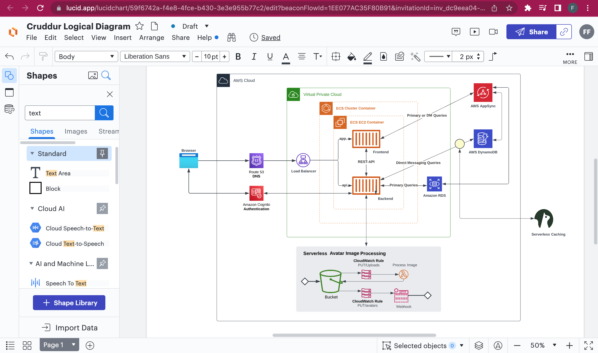

# Week 0 — Billing and Architecture
## Week 0 tasks documentation.
This week, I was able to create accounts on gitpod, rollbar, AWS Free-tier account, honeycomb.io, Github codespaces, and the Bootcamp's repository template.

## The project's Napkin Design
Below is an image of the project's napkin design rendered on lucidchart


## The project's Logical design


## Creation of a user in the admin group
In practise, root accounts are not used to do regular tasks on AWS account. There is a need to create another IAM user that will carry out admin responsibilities. 

To do that, we logged into the console and created a user with custom password, and we also generated security credentials that will enable access to the AWS CLI. We generated an access key and a secret access key for this IAM user.

## Installing AWS CLI 
From the AWS-bootcamp-cruddur-2023 template that was forked on github, I used the gitpod button to launch the code editor. I navigated to the `.gitpod.yml` file to update the tasks to be carried out for the installation of the AWS CLI.

I launched the terminal and cd into gitpod/workspace and used these commands:

```
curl "https://awscli.amazonaws.com/awscli-exe-linux-x86_64.zip" -o "awscliv2.zip"

unzip awscliv2.zip

sudo ./aws/install
```
To set the user credentials without using the `aws configure` command. We then pasted these credentials in a textfile for easy access:

```
export AWS_ACCESS_KEY_ID=""
export AWS_SECRET_ACCESS_KEY=""
export AWS_DEFAULT_REGION="ca-central-1"
```
In the file above, I specified the access key and secret access key that were generated for the admin group user I created from the management console.

To import these values to the AWS CLI, instead of using the `aws configure` command on the terminal, we also used the export lines as saved in the file we created above. For example, on the terminal, we used:
```
export AWS_DEFAULT_REGION="ca-central-1"
```

And to confirm if the credentials adding process was successful, I used the command:
```
aws sts get-caller-identity
``` 
This will output the UserId, Account, and ARN of the admin user.

## Getting the credentials to be permanently stored
If we close the gitpod browser to restart, we will have to input the credentials again, this is because the data stored were done permanently. 

To achieve a more permanent we haven't saved the user's credentials in gitpod's environment file, the memories about them will be wiped out of the computer. However, to permanently save the credentials that were generated, we have to update the .gitpod.yml file with the following commands:
```
tasks:
  - name: aws-cli
    env:
      AWS_CLI_AUTO_PROMPT: on-partial
    init: |
      cd /workspace
      curl "https://awscli.amazonaws.com/awscli-exe-linux-x86_64.zip" -o "awscliv2.zip"
      unzip awscliv2.zip
      sudo ./aws/install
      cd $THEIA_WORKSPACE_ROOT
vscode:
  extensions:
    - 42Crunch.vscode-openapi
```
Then on the terminal, we exchanged the word `export` with `gp env` like so:
```
gp env AWS_DEFAULT_REGION="ca-central-1"
```
This is to enable gitpod use it's environment file to save our credentials so that anytime we log into the account, after the .yml script has run, the credentials saved in its environment will also be applied to authenticate the user.

## Enabling Admin User account access to Billing Dashboard
To enable the user created for admin roles to have access to the billings dashboard, Log into the root user account, on the navigation pane, click on account name, then account to access the `IAM User and Role Access to Billing Information` section. Select the `Activate IAM Access` and click on update to activate. This gives the admin user access to view the Billing Dashboard.


## Creating an AWS Budget
From the AWS CLI documentation page, navigate to `budgets`, then `Create budget` in the available commands section. 

On the left-hand, click on examples and copy the `contents of budget.json` into a folder system you will create (aws/json/budget.json).

Copy the `Contents of notifications-with-subscribers.json` and paste into a corresponding folder in the file system.

From the documentation, we also need to provide these authentication information as shown below:
```
aws budgets create-budget \
    --account-id 111122223333 \
    --budget file://budget.json \
    --notifications-with-subscribers file://notifications-with-subscribers.json
```
To get the account ID from the CLI, we can use the command:
```
aws sts get-caller-identity --query Account 

#or 

aws sts get-caller-identity --query Account --output text
```

We can then set a value for the output to be called `AWS_ACCOUNT_ID`.
```
export AWS_ACCOUNT_ID=$(aws sts get-caller-identity --query Account --output text)
```
To confirm, use:
```
env | grep AWS_ACCOUNT_ID
```
To permanently set the environment variables, use:
```
gp env AWS_ACCOUNT_ID=""
```
We will include the value of the account ID in the code above.

Edit the pathways to the json files as it should be:
```
aws budgets create-budget \
    --account-id $AWS_ACCOUNT_ID \
    --budget file://aws/json/budget.json \
    --notifications-with-subscribers file://aws/json/budget-notifications-with-subscribers.json
```

Having set the AWS_ACCOUNT_ID as an environment variable and updating the file path to the json files, Copy and paste this code on terminal and run it. It shouldn't give any error.

This is what I have on the console after running the command:


## Creating a Billing Alarm through SNS
Use the following command on the terminal
```
aws sns create-topic --name billing-alarm`
```
The next step is to copy this lines of code, edit accordingly and paste on the terminal.
```
aws sns subscribe \
    --topic-arn="sns-generated"\
    --protocol=email \
    --notification-endpoint=domain@email.com
```
This will create an sns that requires confirmation which will be done from the email account.
Also, note that you should search for the SNS service on the console and log into the region. 

## Creating Alarm (on CloudWatch) through the CLI
A json file [alarm-creation.json](../aws/json/alarm_config.json) was created and updated and on the CLI, this command was executed.

```
aws cloudwatch put-metric-alarm --cli-input-json file://aws/json/alarm_config.json
```
This created a CloudWatch alarm as seen below:
