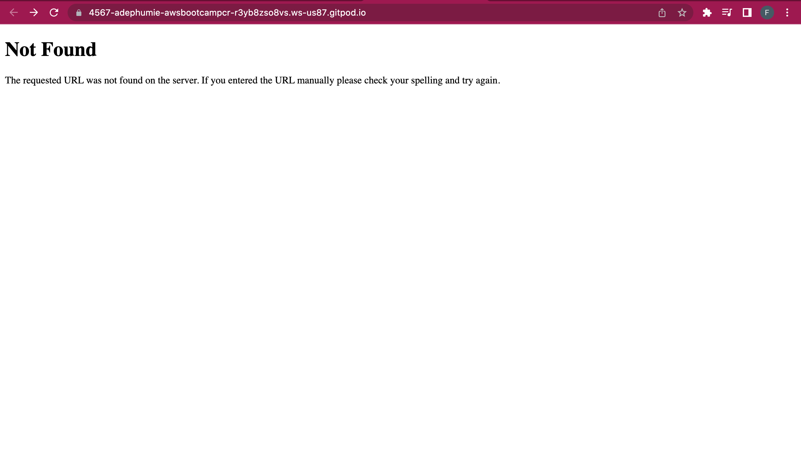
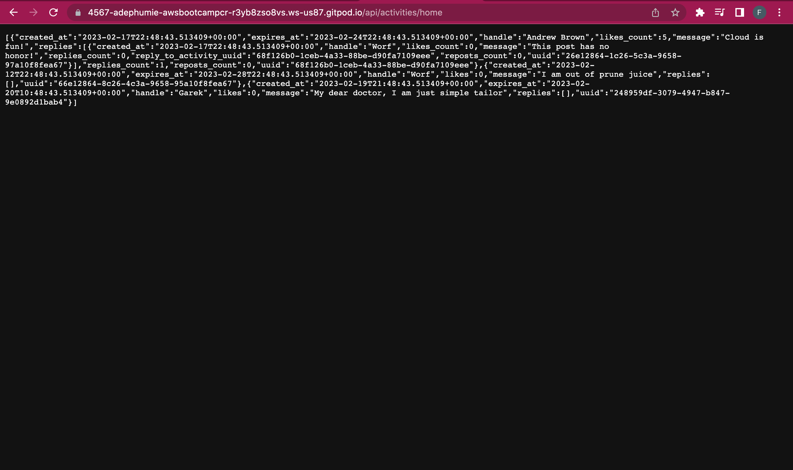
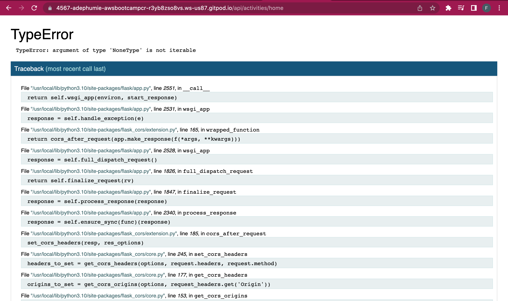
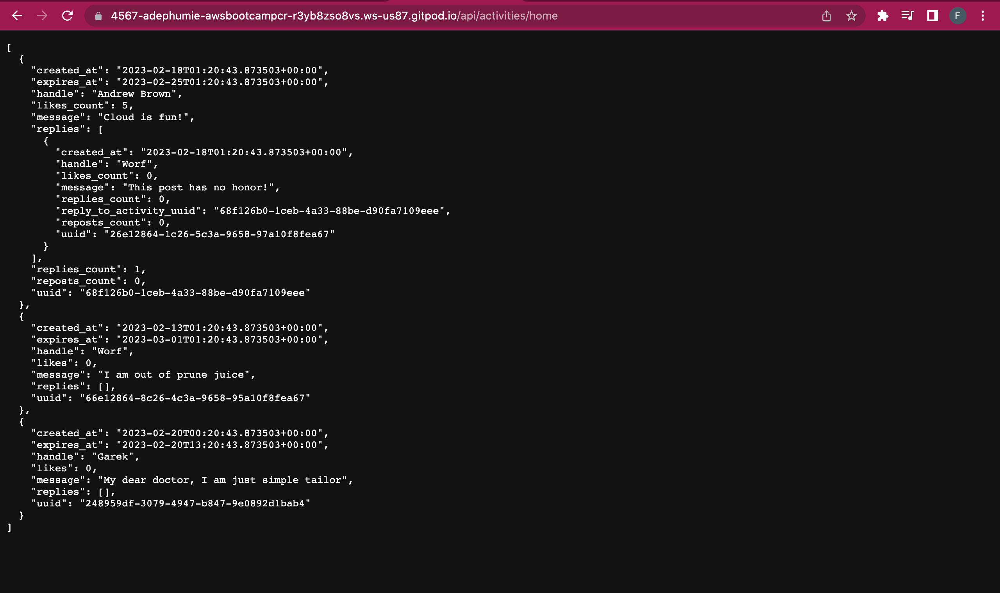
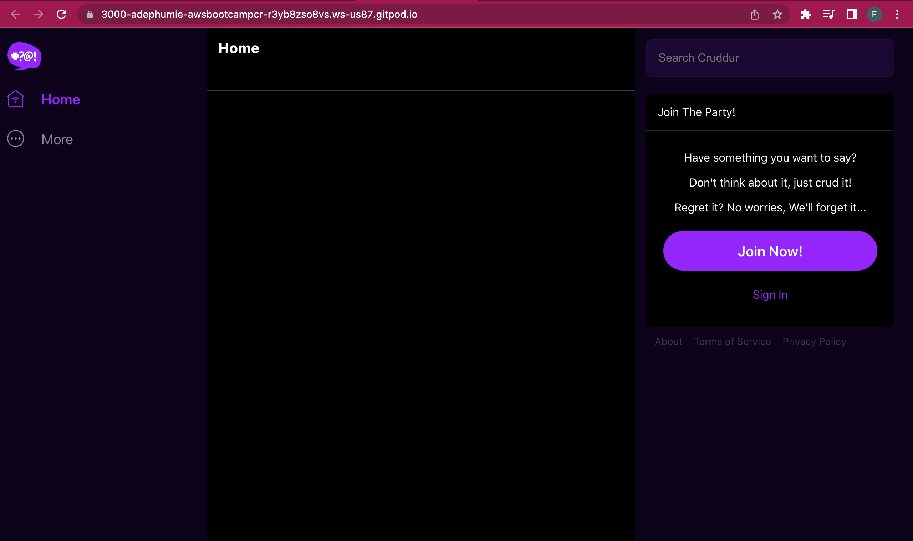
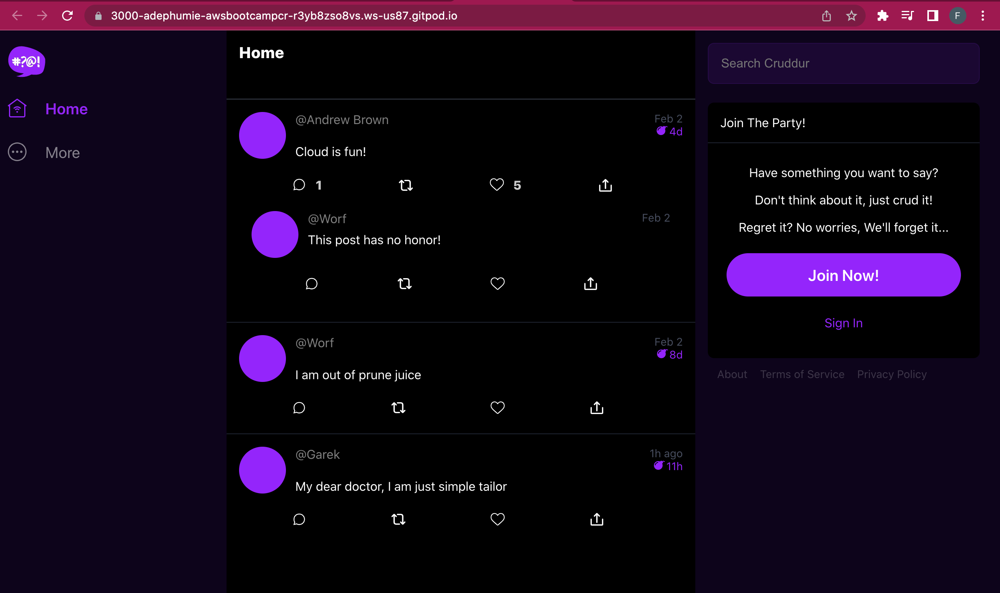

# Week 1 — App Containerization
This represents a documentation for my tasks for the second week of the bootcamp.
<br>
<br>

## <b>Why Containerize our App?</b>
Containerizing applications makes them more lightweight (portable) to be used by others. This makes the app setup less time-consuming. 

Also, it helps to create a common base for everyone to work with because the container will come with all the dependencies required to work on the project.
<br>
<br>

## <b> Enabling Docker Extension</b>
I enabled the docker extension on my editor (VS Code) from the extensions tab.
<br>
<br>

## <b>Running Python App locally</b>
To run the python app locally, we will follow this commands:

```
cd backend-flask
export FRONTEND_URL="*"
export BACKEND_URL="*"
python3 -m flask run --host=0.0.0.0 --port=4567
cd ..
```

Note that the export commands help us set environment variables needed for the app to run. 

On the ports tab, unlock the port to make it public and open the address for the link on the browser. 

The address will run a 404 error not found page as shown:
<br>
<br>



But when you append `/api/activities/home` to the url, you will find json as shown:
<br>
<br>


<br>
<br>

## <b> Containerizing the Backend </b>
To enable us dockerize a project, we will create a file named `Dockerfile` in the same directory. A `Dockerfile` is a `text document` that contains all the commands a user will call on the terminal to build an image.

Docker helps to automatically build an image of an app by looking for the Dockerfile. So, from the `backend-flask` directory, I created a new file called `Dockerfile` and added the following code lines which represents the instructions:

```
FROM python:3.10-slim-buster

WORKDIR /backend-flask

COPY requirements.txt requirements.txt
RUN pip3 install -r requirements.txt

COPY . .

ENV FLASK_ENV=development

EXPOSE ${PORT}
CMD [ "python3", "-m" , "flask", "run", "--host=0.0.0.0", "--port=4567"]
```
<br>

### <b> Explaining the Line of Codes</b>
<b>FROM Python:3.10-slim-buster:</b> This command represents the base image that every other layer will build on.

<b>WORKDIR /backend-flask:</b> This sets the working directory for where the following commands will run `in the container`.

<b>COPY requirements.txt requirements.txt:</b> This command instructs Docker to copy the requirements.txt file (containing libraries the app needs to run) from a relative path on the local machine to the work directory that was specified earlier in the container.

<b>RUN pip3 install -r requirements.txt:</b> This tells Docker to run the command on the container's terminal (command line) to install python libraries required for the app in the container.

<b>COPY . . :</b> This means to copy everything in the local machine's present directory into the working directory of the container.

<b>ENV FLASK_ENV=development:</b> This tells Docker the environment variables to set for the container.

<b>EXPOSE ${PORT}:</b> This will inform Docker about the container will listen on this port at runtime. 

<b>CMD [...]:</b> This tells Docker to run the command `python3 -m flask run --host=0.0.0.0 --port=4567` on the container's terminal to install the flask module.
<br>
<br>

## <b>Building and Running the Dockerfile</b>
To start this process, we need to remove the environment variables we set previously so that they wont interfere with our work. So, I used the commands:

```
unset BACKEND_URL
unset FRONTEND_URL
``` 
To confirm if it works:

```
env | grep BACKEND_URL
env | grep FRONTEND_URL

OR

printenv | grep BACKEND_URL
printenv | grep FRONTEND_URL

```
The output of the commands should be empty.

To build our container image as specified in the DOckerfile, we will run the following commands:

```
cd /workspace/aws-bootcamp-cruddur-2023
docker build -t  backend-flask ./backend-flask
```
The docker build command will help to build our backend app's image throught the Dockerfile. The `-t` option helps us to set a `name:tag` format for the image and it's called `backend-flask`. By default, the first build will be tagged the latest version. And finally, the `./backend-flask` indicates the pathway to our Dockerfile on the local machine.

To run the container, we will use the following command:
```
docker run --rm -p 4567:4567 -it backend-flask
```
After executing the command, click on the ports tab to access the address. It will give 404 error as before because we haven't set the environment variables.

However, the end-point isn't giving the json format but this error as shown below: 


To set the environment variable for the container, 

We can then modify our command to set the variables in our local machine and container's environment.

```
export FRONTEND_URL="*"
export BACKEND_URL="*"
docker run --rm -p 4567:4567 -it  -e FRONTEND_URL -e BACKEND_URL backend-flask
unset FRONTEND_URL="*"
unset BACKEND_URL="*"

OR

docker run --rm -p 4567:4567 -it -e FRONTEND_URL='*' -e BACKEND_URL='*' backend-flask
```
To give this after applying the `api/activities/home` endpoint:


<b>Note that:</b> using the second command will pass the values of the variables you set directly into the container's environment without setting it into the local machine's environment, However, the first set of commands will set the values into the local machine's environment. And that is the reason for using the `unset` command afterward to remove the variables from there.
<br>
<br>

### <b>Accessing the container's shell</b>
There are sevaral ways to gain access into the container's shell. 

<b>1. Use of the command line:</b> You can use this command line on the command line:
```
docker exec -it backend-flask /bin/bash

OR 

docker exec CONTAINER_ID -it /bin/bash
```
This will start the container and also open up the bash shell, helping you to gain access into the working directory of the container.

You can then print the environment variables with the `printenv` command to see if your variables are set. 

<b>2. Using the docker extension:</b> On the Container section of the docker extension of VS Code, Right-click on the specific conatiner you are working with and choose the `Attach to Shell` option, this will drop you into the bash shell of the container you're working with.
<br>
<br>

## <b>Dockerizing the Frontend</b>
Before building the Dockerfile for the frontend, we have to run `npm install` before building the container since it needs to copy the contents of node_modules. 

```
cd /workspace/aws-bootcamp-cruddur-2023/frontend-react-js

npm i
```

Then, create a new Dockerfile in the `frontend-react-js` directory and paste the following code lines in it:
```
FROM node:16.18

ENV PORT=3000

COPY . /frontend-react-js
WORKDIR /frontend-react-js
RUN npm install
EXPOSE ${PORT}
CMD ["npm", "start"]
```
And run this command to build the image:
```
docker build -t frontend-react-js .
```
The next step is to run the container with the following command:
```
docker run -p 3000:3000 -d frontend-react-js
```
On the ports tab, I made the port public and clicked on the address link to the site and I got this image below:


<br>
<br>

## <b>Handling Multiple Containers</b>
We can handle multiple containers by creating a `docker-compose.yml` file at the root of the project. We will add the contents as seen in the file [docker-compose.yml](../docker-compose.yml).

To run the docker-compose file, use:
```
docker compose up

OR 

docker-compose up
```
By running `docker-compose up`, and checking the ports tab, I found two services running together, the frontend and backend. After unlocking the ports and clicking on the URL for the front end, I got this output on the browser page.



